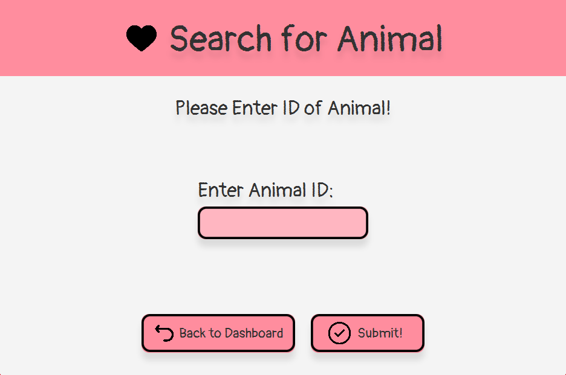

# TinyPawsPetShop

The Tiny Paws Pet Shop System is an application built using the Model-View-Controller (MVC) architecture, written in Java programming language with JavaFX for User Interface (UI), and MySQL for database management. The system allows users to add, view, and edit animals and products in a pet shop.  All users, animals, and products are randomly generated using a seed file to initialize the program. Upon launching the application, users will be presented with a login screen. After logging in, users can access the following features:
1. View Animals and Products: Users can view a list of animals and products available in the pet shop. The list is displayed in a table view, and users can sort the table by clicking on the table headers.
2. Add Animals and Products: Users can add new animals and products to the pet shop. When adding a new animal or product, users will be prompted to enter the relevant details, such as the name, description, price, and image.
3. Edit Animals and Products: Users can edit existing animals and products in the pet shop. When editing an animal or product, users can modify its details and update the record in the database.
4. Search Animals and Products: Users can search for specific animals or products in the pet shop using keywords. The system will display a list of results that match the search query.

User Login Frame & Main Dashboard:

View Animals/Products Frame:

Add Animal/Product Frame:

Edit Animal/Product Frame:

Search Animal/Product Frame:

 
 
